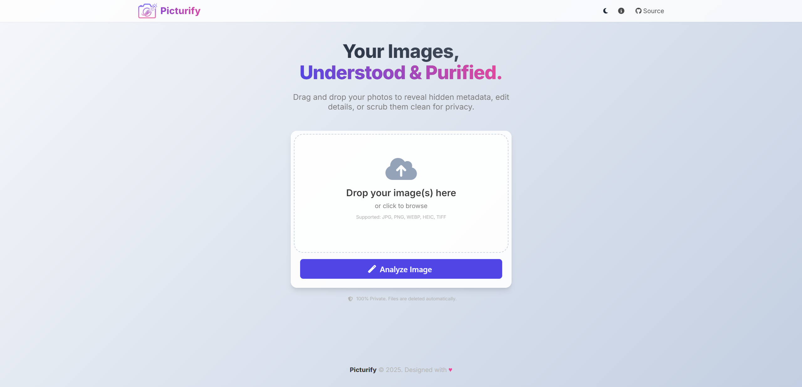
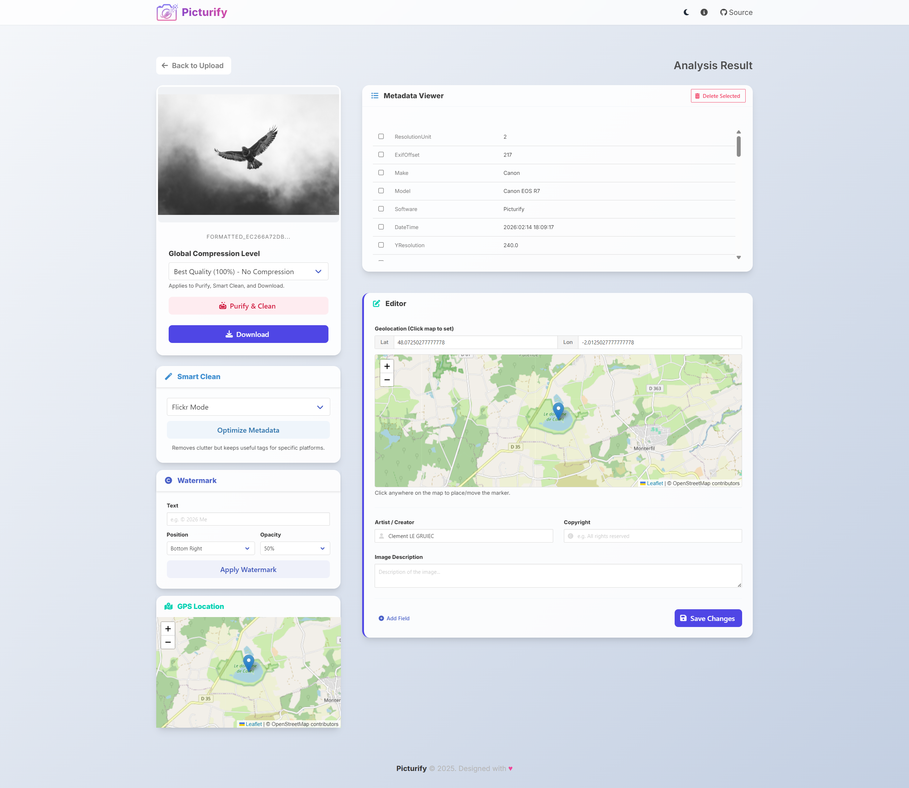

<h1 align="center">Picturify</h1>

<p align="center">
  
  
  
  <a href="https://github.com/ClementLG/Picturify/blob/main/LICENSE">
    
  </a>
</p>

<p align="center">
  <a href="https://www.buymeacoffee.com/clementlg">
    
  </a>
</p>

---

**Picturify** is a web-based tool designed for managing, analyzing, and stripping EXIF metadata from images. It focuses on privacy and batch processing, allowing users to remove sensitive data (GPS coordinates, camera settings) while retaining essential information like copyright.

Built with **Flask** and **Bulma**, the application provides a modern interface for both single-file analysis and bulk operations.

<p align="center">
  
  
</p>

## Features

### Batch Processing
*   **Drag & Drop**: Upload and process multiple files simultaneously.
*   **Metadata Scrubbing**: Remove all EXIF data from uploaded images in a single click.
*   **Template Application**: Apply specific metadata rules (e.g., clear GPS but keep artist info) across a batch.

### Analysis & Editing
*   **Detailed Inspection**: View technical EXIF data including lens, aperture, ISO, and device information.
*   **Geolocation Visualization**: Inspect image locations on an embedded map.
*   **Selective Editing**: Modify specific fields like copyright, artist, and description.
*   **Location Editor**: Add, remove, or modify GPS coordinates directly via the map interface.

### Security
*   **Lossless Processing**: Metadata removal is handled without re-encoding image data where possible to preserve quality.
*   **Auto-Cleanup**: Temporary files are automatically purged based on configurable age limits.
*   **Secure Config**: Implements HSTS, secure headers, and CSRF protection.

## Configuration

The application can be configured via environment variables or `config.py`:

| Variable | Description | Default |
| :--- | :--- | :--- |
| `IMAGE_QUALITY` | JPEG compression quality (1-100) | `100` |
| `IMAGE_SUBSAMPLING` | Chroma subsampling (0=4:4:4, 2=4:2:0) | `0` |
| `MAX_BATCH_SIZE` | Maximum files per upload | `10` |
| `MAX_CONTENT_LENGTH` | Upload size limit | `150 MB` |
| `MAX_FILE_AGE_SECONDS` | Auto-cleanup interval for temp files | `600` |

## Installation

### Docker (Recommended)

```bash
git clone https://github.com/ClementLG/Picturify.git
cd Picturify
docker compose up --build
```
Access the application at `http://localhost:5000`.

### Manual Setup

```bash
pip install -r requirements.txt
python run.py
```

### Environment

*   `production`: Uses Gunicorn for optimal performance.
*   `development`: Enables Flask debug mode with hot reloading.

## License

This project is licensed under the [GPLv3 License](LICENSE).